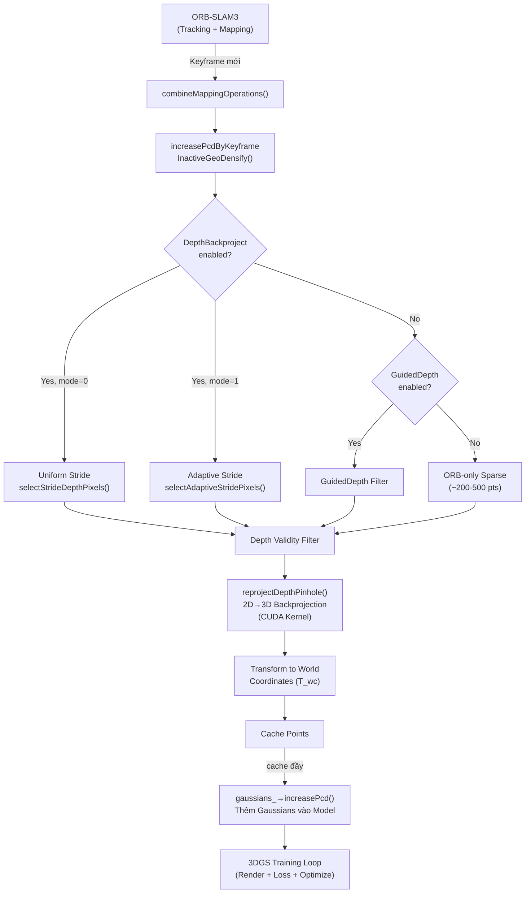
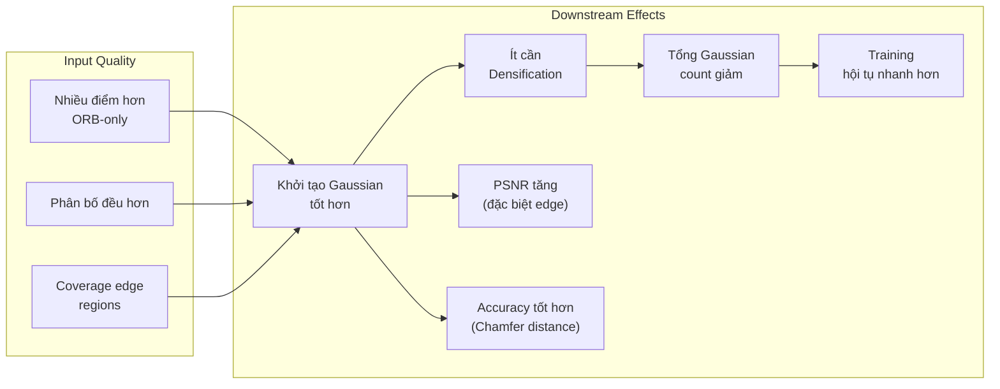

# DepthBackproject — Lý Thuyết, Công Thức Toán Học và Quy Trình Hoạt Động

> **Tổng quan**: Module `DepthBackproject` chịu trách nhiệm **khởi tạo 3D Gaussian** từ ảnh depth (RGB-D) tại mỗi keyframe. Nó thay thế phương pháp gốc chỉ dùng ORB keypoints (rất thưa, ~200-500 điểm) bằng cách lấy mẫu có chiến lược (stratified sampling) trực tiếp từ depth map, tạo ra point cloud dày đặc hơn và phân bố đồng đều hơn để khởi tạo Gaussians.

---

## Mục Lục

1. [Vị Trí Trong Pipeline Tổng Thể](#1-vị-trí-trong-pipeline-tổng-thể)
2. [Khi Nào DepthBackproject Được Gọi](#2-khi-nào-depthbackproject-được-gọi)
3. [Ba Chế Độ Chọn Pixel](#3-ba-chế-độ-chọn-pixel)
   - 3.1 [Uniform Stride](#31-uniform-stride)
   - 3.2 [Adaptive Stride (Edge-Aware)](#32-adaptive-stride-edge-aware)
   - 3.3 [GuidedDepth Filter (Edge-Priority + Grid)](#33-guideddepth-filter-edge-priority--grid)
4. [Công Thức Toán Học Chi Tiết](#4-công-thức-toán-học-chi-tiết)
   - 4.1 [Sobel Edge Detection](#41-sobel-edge-detection)
   - 4.2 [Block-Based Edge Classification (DepthBackproject)](#42-block-based-edge-classification-depthbackproject)
   - 4.3 [Budget Allocation](#43-budget-allocation)
   - 4.4 [Depth Gradient Filtering (GuidedDepth)](#44-depth-gradient-filtering-guideddepth)
   - 4.5 [Grid-Based Uniform Sampling (GuidedDepth)](#45-grid-based-uniform-sampling-guideddepth)
   - 4.6 [Depth Backprojection (Pinhole Model)](#46-depth-backprojection-pinhole-model)
   - 4.7 [World Coordinate Transform](#47-world-coordinate-transform)
5. [Ảnh Hưởng Tới Mô Hình Tổng Thể](#5-ảnh-hưởng-tới-mô-hình-tổng-thể)
6. [Tham Số Cấu Hình](#6-tham-số-cấu-hình)
7. [So Sánh Với Các Phương Pháp Khác](#7-so-sánh-với-các-phương-pháp-khác)

---

## 1. Vị Trí Trong Pipeline Tổng Thể



**Pipeline hoạt động theo thứ tự:**

1. **ORB-SLAM3** phát hiện keyframe mới
2. **GaussianMapper** nhận keyframe, gọi `increasePcdByKeyframeInactiveGeoDensify()`
3. **DepthBackproject** chọn các pixel nào sẽ được backproject (thay vì chỉ dùng ORB keypoints)
4. **Pinhole backprojection** chuyển pixel (u,v,d) → điểm 3D trong camera frame
5. **World transform** chuyển qua world coordinates bằng pose $T_{wc}$
6. **Cache** tích lũy điểm, khi đầy thì **thêm vào Gaussian model** (`increasePcd`)
7. **Training loop** optimize các Gaussian mới này cùng với toàn bộ model

---

## 2. Khi Nào DepthBackproject Được Gọi

DepthBackproject được gọi **mỗi khi có keyframe mới** từ ORB-SLAM3, cụ thể:

| Thời điểm | Hàm gọi | Vị trí code |
|------------|----------|-------------|
| Keyframe mới được tạo | `combineMappingOperations()` | `gaussian_mapper.cpp` |
| ↳ Xử lý RGBD case | `increasePcdByKeyframeInactiveGeoDensify()` | Line 2436-2889 |
| ↳ Chọn pixel | `selectStrideDepthPixels()` hoặc `selectAdaptiveStridePixels()` | `depth_backproject_init.h` |
| ↳ Backproject | `reprojectDepthPinhole()` | `stereo_vision.cu` |

**Tần suất**: Mỗi keyframe (thường ~5-10 frame 1 keyframe tùy scene), nên khoảng vài giây 1 lần trong quá trình chạy SLAM.

---

## 3. Ba Chế Độ Chọn Pixel

### 3.1 Uniform Stride

**Ý tưởng**: Lấy mẫu đều đặn theo lưới cách nhau `stride` pixel.

```
Ảnh gốc (H×W):          Lấy mẫu stride=4:
+------------------+     +--+--+--+--+--+
|                  |     |x |  |  |  |x |
|                  |     |  |  |  |  |  |
|                  |  →  |  |  |  |  |  |
|                  |     |  |  |  |  |  |
|                  |     |x |  |  |  |x |
+------------------+     +--+--+--+--+--+
```

**Thuật toán**:

```
Cho mỗi pixel (r, c) trong ảnh H×W:
    mask(r, c) = (r mod stride == 0) AND (c mod stride == 0)
                 AND (d_min < depth(r,c) < d_max)
```

**Số điểm xấp xỉ**:

$$N_{uniform} \approx \left\lfloor \frac{H}{s} \right\rfloor \times \left\lfloor \frac{W}{s} \right\rfloor$$

với $s$ = stride. Ví dụ: ảnh 480×640, stride=24 → $N \approx 20 \times 27 = 540$ điểm.

---

### 3.2 Adaptive Stride (Edge-Aware)

**Ý tưởng cốt lõi**: Vùng có edge (cạnh, biên) cần nhiều Gaussian hơn vì hình học phức tạp. Vùng phẳng (flat) cần ít hơn. → Dùng stride nhỏ ở vùng edge, stride lớn ở vùng flat.

```
Ảnh gốc:                  Adaptive sampling:
+--------+--------+       +--------+--------+
|  WALL  | EDGE   |       | x    x | xxxxxxx|  ← stride_max=8 (wall)
|  (flat)|  ↕     |       |        | xxxxxxx|  ← stride_min=2 (edge)
|        | OBJECT |       | x    x | xxxxxxx|
+--------+--------+       +--------+--------+
| FLOOR  |  DOOR  |       | x    x | x    x |
|  (flat)|  (flat)|       |        |        |
|        |        |       | x    x | x    x |
+--------+--------+       +--------+--------+
```

**5 bước thuật toán:**

> **Bước 1**: Tính Sobel edge map  
> **Bước 2**: Chia ảnh thành grid các block  
> **Bước 3**: Phân loại mỗi block: edge hay flat  
> **Bước 4**: Thu thập pixel theo stride tương ứng + Budget allocation  
> **Bước 5**: Tạo mask boolean cuối cùng + depth filter  

---

### 3.3 GuidedDepth Filter (Edge-Priority + Grid)

> **File**: [guided_depth_filter.h](file:///media/tam/DATA/3D/CG-photo/include/guided_depth_filter.h)  
> **Tham khảo**: He et al., "Guided Image Filtering", ECCV 2010; Knutsson & Westin, "Normalized Convolution", CVPR 1993

**Ý tưởng**: Thay vì dùng stride cố định per block (như DepthBackproject), GuidedDepth phân loại **từng pixel** thành edge hoặc uniform, sau đó:
- **Edge pixels**: Sort theo edge strength giảm dần → lấy **top-K mạnh nhất** (deterministic)
- **Uniform pixels**: Dùng **grid-based sampling** (1 pixel/cell) → đảm bảo spatial coverage
- **ORB keypoints**: Luôn được bao gồm (consistency với baseline)
- **Depth gradient filter**: Loại bỏ "flying pixels" — nơi depth thay đổi đột ngột → depth không tin cậy

**9 bước thuật toán:**

```
Bước 1: Download RGB + Depth về CPU
Bước 2: Tạo valid depth mask (range check: d_min < d < d_max)
Bước 3: Depth gradient filtering → loại flying pixels
Bước 4: Tính Sobel edge strength trên RGB (giống DepthBackproject)
Bước 5: Phân loại từng pixel: edge (M > τ) hoặc uniform (M ≤ τ)
Bước 6: Budget allocation (edge_ratio split)
Bước 7: Sampling
         - Edge: sort by strength ↓, lấy top-K
         - Uniform: 1 pixel/grid cell, random pick
Bước 8: Merge: ORB keypoints ∪ edge samples ∪ uniform samples
Bước 9: Convert sang torch boolean mask [H*W]
```

**Điểm khác biệt chính với DepthBackproject Adaptive:**

| Tiêu chí | DepthBackproject Adaptive | GuidedDepth Filter |
|----------|--------------------------|--------------------|
| Đơn vị phân loại | **Block** (16×16 pixel) | **Pixel** (từng điểm) |
| Edge sampling | Stride grid trong block | **Top-K by strength** (deterministic) |
| Flat sampling | Stride grid trong block | **Grid-based** (1 per cell) |
| Depth quality check | Chỉ range check | Range + **gradient filter** (flying pixels) |
| ORB keypoints | Không bao gồm | **Luôn bao gồm** |
| Seed | Random (time-based) | **Fixed seed** (reproducible) |

---

## 4. Công Thức Toán Học Chi Tiết

### 4.1 Sobel Edge Detection

Cho ảnh grayscale $I(x,y)$, gradient theo $x$ và $y$ được tính bằng convolution với Sobel kernel 3×3:

$$G_x = \begin{bmatrix} -1 & 0 & +1 \\ -2 & 0 & +2 \\ -1 & 0 & +1 \end{bmatrix} * I$$

$$G_y = \begin{bmatrix} -1 & -2 & -1 \\ 0 & 0 & 0 \\ +1 & +2 & +1 \end{bmatrix} * I$$

**Magnitude (cường độ edge)**:

$$M(x,y) = \sqrt{G_x(x,y)^2 + G_y(x,y)^2}$$

**Chuẩn hóa về [0, 1]**:

$$\hat{M}(x,y) = \frac{M(x,y)}{\max_{(x,y)} M(x,y)}$$

> **Lý do dùng Sobel trên RGB**: Edge trong ảnh RGB tương ứng với ranh giới đối tượng (object boundary), nơi cần Gaussian dày đặc nhất để tái tạo chi tiết. Sobel nhanh, ổn định, và cho kết quả tốt cho mục đích phân loại binary edge/flat.

---

### 4.2 Block-Based Edge Classification (DepthBackproject)

Ảnh được chia thành grid:

$$G_h = \left\lceil \frac{H}{B} \right\rceil, \quad G_w = \left\lceil \frac{W}{B} \right\rceil$$

với $B$ = `block_size` (thường = 16).

Mỗi block $(i, j)$ bao phủ vùng pixel:

$$\text{Block}(i,j) = \{(r,c) \mid iB \leq r < \min((i+1)B, H), \; jB \leq c < \min((j+1)B, W)\}$$

**Cường độ edge tối đa trong block**:

$$E_{ij} = \max_{(r,c) \in \text{Block}(i,j)} \hat{M}(r,c)$$

**Phân loại block**:

$$\text{type}(i,j) = \begin{cases} \text{edge} & \text{if } E_{ij} \geq \tau_{edge} \\ \text{flat} & \text{if } E_{ij} < \tau_{edge} \end{cases}$$

với $\tau_{edge}$ = `edge_threshold` (thường = 0.08).

**Stride được gán**:

$$s(i,j) = \begin{cases} s_{min} & \text{if type}(i,j) = \text{edge} \\ s_{max} & \text{if type}(i,j) = \text{flat} \end{cases}$$

| Tham số | Giá trị mặc định | Ý nghĩa |
|---------|-------------------|---------|
| $s_{min}$ | 2 | Dense stride cho vùng edge: lấy mẫu mỗi 2 pixel → rất chi tiết |
| $s_{max}$ | 8 | Sparse stride cho vùng flat: lấy mẫu mỗi 8 pixel → tiết kiệm |

**Pixel được chọn trong block** $(i,j)$:

$$\text{Pixels}(i,j) = \{(r,c) \in \text{Block}(i,j) \mid r \equiv r_{start} \pmod{s(i,j)} \text{ and } c \equiv c_{start} \pmod{s(i,j)}\}$$

---

### 4.3 Budget Allocation

Sau khi thu thập xong, ta có hai tập:
- $\mathcal{E}$ = tập pixel từ edge blocks, $|\mathcal{E}| = N_e$
- $\mathcal{F}$ = tập pixel từ flat blocks, $|\mathcal{F}| = N_f$

**Nếu tổng vượt budget** $B_{max}$ (`max_points_per_keyframe`):

$$\text{if } N_e + N_f > B_{max}:$$

1. **Phân bổ theo tỉ lệ**:

$$B_e = \lfloor B_{max} \times \rho \rfloor, \quad B_f = B_{max} - B_e$$

với $\rho$ = `edge_ratio` (thường = 0.8, tức 80% budget cho edge).

2. **Tái phân bổ phần thừa**:

$$\text{if } N_e \leq B_e: \quad B_f \leftarrow B_{max} - N_e \quad \text{(dành surplus cho flat)}$$

$$\text{if } N_f \leq B_f: \quad B_e \leftarrow B_{max} - N_f \quad \text{(dành surplus cho edge)}$$

3. **Random subsampling** nếu vẫn vượt budget:

$$\text{if } N_e > B_e: \quad \text{shuffle}(\mathcal{E}), \text{ keep first } B_e$$

$$\text{if } N_f > B_f: \quad \text{shuffle}(\mathcal{F}), \text{ keep first } B_f$$

> **Triết lý**: Edge pixels có **ưu tiên cao hơn** vì chúng nằm ở boundary giữa các object — nơi chất lượng rendering nhạy cảm nhất. Flat pixels cần ít hơn vì vùng phẳng có thể được bao phủ bởi ít Gaussian lớn.

---

### 4.4 Depth Gradient Filtering (GuidedDepth)

GuidedDepth có thêm bước lọc **flying pixels** — những pixel nằm ở ranh giới depth discontinuity (ví dụ: cạnh bàn nhô ra trước tường xa). Tại đây depth thay đổi đột ngột và sensor depth thường sai.

**Tính gradient depth bằng Sobel**:

$$\nabla_x D = S_x * D, \quad \nabla_y D = S_y * D$$

$$|\nabla D|(x,y) = \frac{\sqrt{(\nabla_x D)^2 + (\nabla_y D)^2}}{\text{sobel\_scale}}$$

với `sobel_scale` = 8.0 cho kernel size 3 (chuẩn hóa theo hệ số khuếch đại Sobel).

**Loại bỏ flying pixels**:

$$\text{valid}(x,y) = \text{valid}(x,y) \wedge \left( |\nabla D|(x,y) \leq \tau_{grad} \right)$$

với $\tau_{grad}$ = `depth_gradient_threshold` (thường = 0.5 m/pixel).

> **Lý do**: Flying pixels ở depth edges tạo ra Gaussians "treo" giữa không trung — chúng không thuộc surface nào, gây artifact trong rendering và làm giảm chất lượng geometry.

---

### 4.5 Grid-Based Uniform Sampling (GuidedDepth)

Thay vì stride grid đơn giản, GuidedDepth dùng **grid cell sampling** cho vùng flat:

1. Chia ảnh thành grid $G_h \times G_w$ cells, mỗi cell kích thước `grid_cell_size` × `grid_cell_size`

$$G_h = \left\lceil \frac{H}{g} \right\rceil, \quad G_w = \left\lceil \frac{W}{g} \right\rceil$$

với $g$ = `grid_cell_size` (thường = 8).

2. Mỗi cell: thu thập tất cả uniform (non-edge) pixels hợp lệ
3. **Random pick 1 pixel per cell** → đảm bảo spatial coverage đều

$$\text{Cho mỗi cell } (i,j): \quad p_{ij} = \text{random\_choice}(\{\text{valid uniform pixels in cell}(i,j)\})$$

**Edge pixel sampling** thì khác — dùng **deterministic top-K**:

$$\text{Sort } \mathcal{E} \text{ theo } \hat{M}(x,y) \text{ giảm dần} \rightarrow \text{lấy } B_e \text{ pixel đầu tiên}$$

> **Lý do dùng top-K thay vì random**: Pixel có edge strength cao nhất là boundary quan trọng nhất (object silhouette, sharp corners). Random sampling có thể bỏ sót chúng.

---

### 4.6 Depth Backprojection (Pinhole Model)

Cho mỗi pixel $(u, v)$ đã chọn, với depth $d(u,v)$ và camera intrinsics $(f_x, f_y, c_x, c_y)$:

**Chuyển từ pixel (2D) sang điểm 3D trong camera frame**:

$$\mathbf{P}_{cam} = \begin{pmatrix} X_c \\ Y_c \\ Z_c \end{pmatrix} = \begin{pmatrix} \frac{(u - c_x) \cdot d}{f_x} \\ \frac{(v - c_y) \cdot d}{f_y} \\ d \end{pmatrix}$$

> Đây là **phép chiếu ngược** (inverse projection) của mô hình pinhole camera:
> 
> $$\begin{pmatrix} u \\ v \\ 1 \end{pmatrix} = \frac{1}{Z_c} \begin{pmatrix} f_x & 0 & c_x \\ 0 & f_y & c_y \\ 0 & 0 & 1 \end{pmatrix} \begin{pmatrix} X_c \\ Y_c \\ Z_c \end{pmatrix}$$

**Điều kiện depth hợp lệ**:

$$d_{min} < d(u,v) < d_{max}$$

| Dataset | $d_{min}$ | $d_{max}$ | Lý do |
|---------|-----------|-----------|-------|
| Replica | 0.001 m | 10.0 m | Dataset synthetic, depth chính xác |
| TUM | 0.001 m | 5.0 m | Kinect sensor chỉ reliable đến ~5m |

**CUDA implementation**: Mỗi pixel được xử lý bởi 1 CUDA thread song song, tạo điểm 3D trực tiếp trên GPU — rất nhanh.

---

### 4.7 World Coordinate Transform

Sau khi có $\mathbf{P}_{cam}$ trong camera frame, chuyển sang world frame bằng camera-to-world pose $T_{wc}$:

$$T_{wc} = T_{cw}^{-1} = \begin{pmatrix} R_{wc} & \mathbf{t}_{wc} \\ \mathbf{0}^T & 1 \end{pmatrix} \in SE(3)$$

$$\mathbf{P}_{world} = R_{wc} \cdot \mathbf{P}_{cam} + \mathbf{t}_{wc}$$

Trong code, đây là:
```cpp
torch::Tensor Twc_tensor = ... Twc.matrix() ...;
transformPoints(points3D_valid, Twc_tensor);
```

---

## 5. Ảnh Hưởng Tới Mô Hình Tổng Thể

### 5.1 Trước DepthBackproject (Baseline: ORB-only)

| Đặc điểm | ORB-only |
|-----------|----------|
| Số điểm/keyframe | ~200-500 (chỉ ORB keypoints) |
| Phân bố | **Rất không đều** — ORB tập trung vào texture-rich regions |
| Vùng thiếu | Tường trơn, sàn, trần → **không có Gaussian** |
| Hệ quả | Model phải dựa hoàn toàn vào densification (clone/split) để fill gaps → chậm, tốn VRAM |

### 5.2 Sau DepthBackproject

| Đặc điểm | DepthBackproject (Adaptive) |
|-----------|----------------------------|
| Số điểm/keyframe | ~1000-1500 (kiểm soát bằng budget) |
| Phân bố | **Có chiến lược** — dense ở edge, sparse ở flat |
| Coverage | Phủ đều toàn ảnh, kể cả vùng textureless |
| Hệ quả | Model khởi đầu tốt hơn → ít cần densification → ít Gaussian tổng → nhanh hơn |

### 5.3 Tác Động Cụ Thể Lên Các Thành Phần



| Metric | ORB-only (Baseline) | + DepthBackproject | Giải thích |
|--------|---------------------|---------------------|------------|
| **PSNR** | ~36-37 dB | ~38-39 dB | Gaussian phủ tốt hơn → ít artifact |
| **Gaussian count** | Nhiều | Ít hơn | Khởi tạo tốt → ít cần clone/split |
| **Accuracy** | ~1.6 cm | ~1.4 cm | Mehr 3D points → geometry chính xác hơn |
| **Training time** | Chậm hơn | Nhanh hơn | Ít densification iterations |
| **Edge quality** | Mờ, blurry edges | Sharp edges | Stride_min=2 → dense coverage ở edge |

### 5.4 Interaction Với Các Module Khác

| Module | Tương tác |
|--------|-----------|
| **Wavelet Init** | Chạy SAU DepthBackproject, thêm extra points ở edge dựa trên wavelet decomposition |
| **GeoAware Init** | Chạy SAU DepthBackproject, dùng point_valid_flags từ DepthBackproject để tính normal + scale cho mỗi Gaussian |
| **Densification** | DepthBackproject giảm gánh nặng cho densification vì model đã được khởi tạo phủ đều |
| **GuidedDepth** | **Bị override** khi DepthBackproject enabled (mutually exclusive, DepthBackproject có priority cao hơn) |
| **Training Loss** | Gaussian cover đều hơn → L1 + SSIM loss thấp hơn ngay từ đầu |

---

## 6. Tham Số Cấu Hình

### 6.1 DepthBackproject

```yaml
DepthBackproject.enabled: 1            # 0=tắt, 1=bật (override GuidedDepth)
DepthBackproject.mode: 1               # 0=uniform, 1=adaptive (edge-aware)
DepthBackproject.stride: 24            # Uniform mode: stride cố định
DepthBackproject.stride_min: 2         # Adaptive: stride cho vùng edge
DepthBackproject.stride_max: 8         # Adaptive: stride cho vùng flat
DepthBackproject.block_size: 16        # Kích thước block phân loại edge/flat
DepthBackproject.edge_threshold: 0.08  # Ngưỡng edge [0,1]
DepthBackproject.edge_ratio: 0.8       # Tỉ lệ budget cho edge (0.8 = 80%)
DepthBackproject.max_points_per_keyframe: 1500  # Budget cap (0=unlimited)
DepthBackproject.min_depth: 0.001      # Depth tối thiểu (m)
DepthBackproject.max_depth: 10.0       # Depth tối đa (m)
```

### 6.2 GuidedDepth Filter

```yaml
GuidedDepth.enabled: 0                     # 0=tắt, 1=bật (bị override bởi DepthBackproject)
GuidedDepth.max_points_per_keyframe: 1500  # Budget cap
GuidedDepth.edge_sample_ratio: 0.9         # 90% budget cho edge, 10% cho uniform
GuidedDepth.edge_threshold: 0.1            # Ngưỡng edge [0,1] (per-pixel)
GuidedDepth.depth_gradient_threshold: 0.5  # Max depth gradient (m/pixel) — loại flying pixels
GuidedDepth.grid_cell_size: 8              # Kích thước cell cho uniform sampling
GuidedDepth.min_valid_depth_ratio: 0.01    # Tỉ lệ depth hợp lệ tối thiểu để xử lý
```

> [!IMPORTANT]
> **Priority**: `DepthBackproject.enabled=1` sẽ **override** GuidedDepth, bất kể GuidedDepth.enabled. Chỉ 1 trong 2 được dùng tại cùng thời điểm. Nếu cả hai đều tắt → fallback về ORB-only sparse.

### Hướng dẫn tuning:

| Tham số | Tăng → | Giảm → |
|---------|--------|--------|
| `stride_min` | Ít điểm edge → nhanh hơn | Nhiều điểm edge → chi tiết hơn |
| `stride_max` | Ít điểm flat → tiết kiệm | Nhiều điểm flat → phủ tốt hơn |
| `block_size` | Block lớn → phân loại thô | Block nhỏ → phân loại tinh |
| `edge_threshold` | Ít block classifed edge → few dense | Nhiều block classified edge → more dense |
| `edge_ratio` | Nhiều budget cho edge | Nhiều budget cho flat |
| `max_points_per_keyframe` | Nhiều Gaussian → chậm | Ít Gaussian → nhanh nhưng thiếu |

---

## 7. So Sánh Với Các Phương Pháp Khác

| Phương pháp | Cách chọn pixel | Ưu điểm | Nhược điểm |
|-------------|-----------------|---------|------------|
| **ORB-only** | Chỉ ORB keypoints (~200-500) | Nhanh, đơn giản | Thiếu coverage, bias texture |
| **GuidedDepth** | Per-pixel edge + grid + depth gradient filter | Loại flying pixels, top-K edge, reproducible | Chậm hơn (sort + grid), cần tuning nhiều param |
| **Uniform Stride** | Grid đều cách stride pixel | Phủ đều, đơn giản | Không thích ứng nội dung |
| **Adaptive Stride** ✅ | Block-based dense/sparse stride | Tốt nhất: chất lượng + hiệu quả | Cần tính Sobel (~1-3ms) |

### Chi tiết so sánh GuidedDepth vs DepthBackproject Adaptive

| Tiêu chí | DepthBackproject Adaptive | GuidedDepth Filter |
|----------|--------------------------|--------------------|
| **Granularity** | Block-level (16×16) | Pixel-level |
| **Edge selection** | Stride grid (spatial uniform in edge block) | Top-K strongest edges (deterministic) |
| **Flat selection** | Stride grid | Grid cell: 1 random pixel per 8×8 cell |
| **Flying pixel rejection** | ❌ Không có | ✅ Depth gradient filter |
| **ORB inclusion** | ❌ Không | ✅ Luôn bao gồm |
| **Reproducibility** | Random seed (time-based) | Fixed seed (seed=42) |
| **Tốc độ** | Nhanh hơn (~1-3ms) | Chậm hơn (~3-10ms, do sort) |
| **Khi nào dùng** | Default, general purpose | Khi cần loại flying pixels hoặc cần deterministic |

---

## Tóm Tắt Quy Trình Hoàn Chỉnh

```
┌──────────────── Keyframe mới từ ORB-SLAM3 ────────────────┐
│                                                            │
│  1. Upload RGB + Depth lên GPU                             │
│  2. Chuyển sang torch::Tensor (flatten H*W)                │
│                                                            │
│  ┌─── DepthBackproject (mode=1, adaptive) ───┐             │
│  │                                           │             │
│  │  a. RGB → Grayscale → Sobel (Gx, Gy)     │             │
│  │  b. Magnitude M = √(Gx²+Gy²), normalize  │             │
│  │  c. Chia ảnh thành blocks B×B             │             │
│  │  d. Mỗi block: max_edge → edge/flat      │             │
│  │  e. Edge block → stride_min (dense)       │             │
│  │     Flat block → stride_max (sparse)      │             │
│  │  f. Budget allocation (edge priority)     │             │
│  │  g. Depth validity filter                 │             │
│  │  → Output: boolean mask [H*W]             │             │
│  └───────────────────────────────────────────┘             │
│                                                            │
│  3. reprojectDepthPinhole() — CUDA kernel                  │
│     (u,v,d) → (X,Y,Z) trong camera frame                  │
│                                                            │
│  4. Transform points → world coordinates (T_wc)            │
│                                                            │
│  5. Cache → khi đầy → gaussians_->increasePcd()            │
│     → Thêm 3D Gaussians vào model                         │
│                                                            │
│  6. Training loop optimize Gaussians mới + cũ              │
│     (Render → L1/SSIM loss → Backprop → Adam)             │
└────────────────────────────────────────────────────────────┘
```

---

## Tài Liệu Tham Khảo (Source Code)

| File | Nội dung |
|------|----------|
| [depth_backproject_init.h](file:///media/tam/DATA/3D/CG-photo/include/depth_backproject_init.h) | Config struct + 2 hàm chọn pixel (uniform + adaptive) |
| [guided_depth_filter.h](file:///media/tam/DATA/3D/CG-photo/include/guided_depth_filter.h) | GuidedDepth: edge-priority + grid + depth gradient filter |
| [gaussian_mapper.cpp](file:///media/tam/DATA/3D/CG-photo/src/gaussian_mapper.cpp#L2590-L2890) | Integration: gọi DepthBackproject/GuidedDepth trong RGBD case |
| [stereo_vision.cu](file:///media/tam/DATA/3D/CG-photo/src/stereo_vision.cu#L39-L61) | CUDA kernel backprojection pinhole |
| [stereo_vision.h](file:///media/tam/DATA/3D/CG-photo/cuda_rasterizer/stereo_vision.h#L41-L55) | Device function `reproject_depth_pinhole()` |
| [replica_rgbd.yaml](file:///media/tam/DATA/3D/CG-photo/cfg/gaussian_mapper/RGB-D/Replica/replica_rgbd.yaml#L134-L155) | Config cho Replica (cả 2 module) |
| [tum_rgbd.yaml](file:///media/tam/DATA/3D/CG-photo/cfg/gaussian_mapper/RGB-D/TUM/tum_rgbd.yaml#L134-L155) | Config cho TUM (cả 2 module) |
